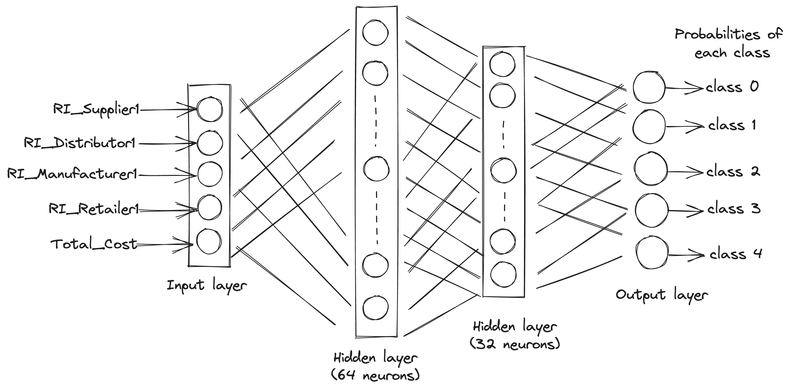

 

---
Results:

**Accuracy: 0.9932**  
**Precision: 0.9932**  
**Recall: 0.9932**  
**F1-score: 0.9932**  
Confusion Matrix:  
[[21560    20   192    53    38]  
 [    4 44161     0    84     0]  
 [  304     0 48254     1    18]  
 [   22    42     0 24804    10]  
 [  109     1    22    73  6695]]  

---

Dataset is of a particular supply chain network.  
4 echelons of this supply chain are :
Supplier, Distributor, Manufacturer and Retailer.  
Risk is associated with each echelon.  
Risk Index is calculated for each echelon.  

Risk Index for Supplier echelon can be formulated as:  
$$RI_{supplier} = \sum_{i=1}^{n} as_{ij} . bs_{ij} . (1 - (1-\Pi_{j=1}^{m} P(S_{ij}) ) )$$

$i$: i-th supplier  
$j$: j-th demand  
n: number of suppliers  
m: number of demands

Where $as_{ij}$ is the consequence to the supply chain if the i-th supplier fails,
$bs_{ij}$ is the percentage of value added to the product by the i-th supplier,
$P(S_{ij})$ denotes the marginal probability that the i-th supplier fails for j-th demand

Similary,

$$RI_{distributor} = ad_{risk_i}.bm_i.(1-(1-P(M_j)))$$
$$RI_{manufacturer} = am_{risk_i}.bm_i.(1-(1-P(M_j)))$$
$$RI_{retailer} = ar_{risk_i}.br_i.(1-(1-P(R_j)))$$

The risk fluctuation subjected to the supply chain network is simulated by a sine-wave generator. This adds a dynamic and time-varying aspect to the dataset, enabling the study of how Risk Index values and other attributes change over time. 
In real life also some Risk is associated with each echelon which we don't know in advance. Actual risk index can be calculated only after happening. In our dataset Risk Indices and total cost are calculated and recorded at different different time stamps.

---

SCM Stability Category:  
The SCM stability category is a discrete classification assigned to different time periods in the dataset. It categorizes the stability of the supply chain based on observed characteristics or metrics. The categories likely range from lower stability (higher risk, higher uncertainty) to higher stability (lower risk, more predictability).

---

### References:

Banerjee, Heerok; Saparia, Grishma; Ganapathy, Velappa; Garg, Priyanshi; Shenbagaraman, V. M. (2019), [“Time Series Dataset for Risk Assessment in Supply Chain Networks"](https://data.mendeley.com/datasets/gystn6d3r4/2), Mendeley Data, V2, doi: 10.17632/gystn6d3r4.2

Saparia, Grishma & Banerjee, Heerok & Garg, Priyanshi & Ganapathy, V. & V M, Shenbagaraman. (2019). [Time-series Dataset for Risk Assessment in Multi-echelon Supply Chain Networks.](https://www.researchgate.net/publication/332343841_Time-series_Dataset_for_Risk_Assessment_in_Multi-echelon_Supply_Chain_Networks) 10.17632/gystn6d3r4.2". 

